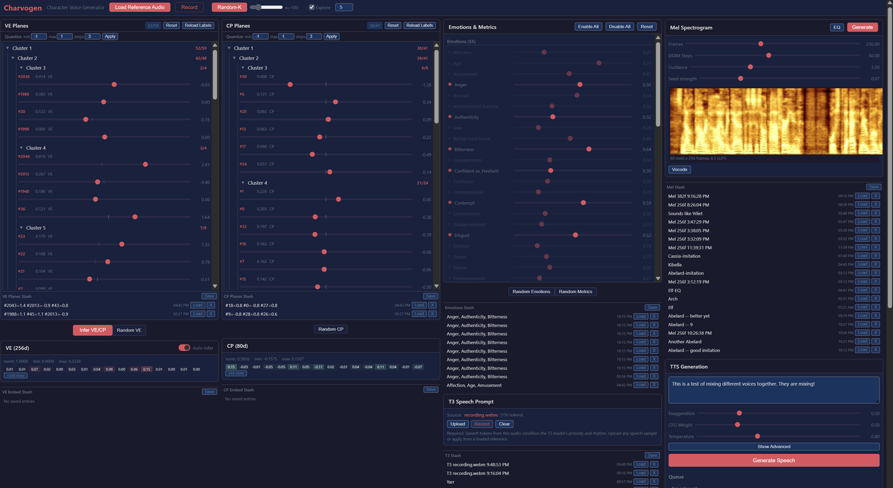

# Charvogen

Generate all the style information required for [Chatterbox TTS](https://github.com/resemble-ai/chatterbox) from scratch, without relying on references.

Charvogen can also analyze and modify vectors from an existing reference to add or remove features from the voice. Its main use is to imitate characters using only human comparison.

Originally made for voicing *Warhammer 40K: Rogue Trader*. The training dataset for all original models contains only 3 games, specifically excluding Rogue Trader and other OwlCat games. I hope this project makes voicing text-heavy games easier — and makes voice actors more comfortable licensing their voices for cloning.



## License

Code is MIT licensed, except for the mel diffuser (`models/mel/`), which is [CC-BY-NC-SA-4.0](https://creativecommons.org/licenses/by-nc-sa/4.0/).

Model weights are [CC-BY-NC-4.0](https://creativecommons.org/licenses/by-nc/4.0/) (non-commercial).

## How does it work?

Chatterbox TTS requires several pieces to work:

- **Voice-encoder vector**
- **CAM++ vector**
- **S3 mel-spec sample**
- **T3 tokens**

### Generating voice-encoder and CAM++ vectors

Voice-encoder and CAM++ are entangled and define most of the characteristics of the voice. However, they are not even interpolatable (swiss cheese), let alone interpretable.

Charvogen uses a trained **Variational Autoencoder (VAE)** that can only embed reasonably-sounding voices (informed by the training set) and interpolate between them. The VAE is conditioned to disentangle known emotions (tagged with Empathic-Insight-Voice-Small) and a few metrics (tagged with dataspeech).

This compresses a 256d Chatterbox vector into a vMF 128d vector, which is interpolatable and disentangled from emotions. This is further compressed by training a **Sparse Autoencoder (SAE)** in hopes of making this vector interpretable. It is interpretable to some extent, but not so much as for it to be useful. It additionally compresses the VE/CP vectors into 60d/40d plane rotations.

The optimal number of emotions for driving the model is 7, but 4–10 give good results. The VAE also works well with 0 or all emotions specified.

### Generating an S3 mel-spec sample

> **Note:** Licensed CC-BY-NC-SA-4.0 International. Not required for Charvogen operation.

When working on VE/CAM++, I noticed that the voices they describe mostly define the character, which makes it possible for the vectors to pull the spectrum in a particular direction.

For this, I trained a mel-spec diffusion model roughly based on the AudioLDM2 architecture, but without text conditioning. Inputs are raw VE/CAM++ vectors.

The resulting voice clip requires a seed to converge (the supplied one is from LibriSpeech, but any sensible voice clip will work and will not affect output much) and sounds like nonsense, but contains all the spectrum information necessary for Chatterbox TTS to do its thing.

### Providing T3 tokens

T3 tokens are straightforward to make yourself by speaking into your PC mic, which will control mostly tempo and emotionality.

## Requirements

- A recent NVIDIA GPU with at least 16 GB of VRAM
- [Python 3.14.x](https://www.python.org/downloads/)
- [Recent Node.js](https://nodejs.org/)
- [ffmpeg](https://ffmpeg.org/download.html) in your user or system `PATH`

## Installing

### Windows

Run `install.cmd`, or manually:

Build the Svelte frontend:

```bash
cd gui/frontend
npm install
npm run build
```

## Running

```bash
python -m gui.backend
```

Or on Windows, run `run.cmd`.

## Workflow

1. Start with a reference that's close to your target voice (and for which you have a right to voice-clone). Record it using a microphone or upload. Having STT corpuses like Mozilla Common Voice or LibriSpeech on hand, with some good average-picked voices, helps.

2. Load a temporary reference — it will be replaced later, Ship of Theseus style.

3. Use **Explore** to sample random voices at a controlled distance from the source voice. `κ = 1` samples nearly uniformly over the sphere; higher `κ` narrows the search to a spherical cap around the source.

4. This adds N entries to config stash. Generate them all by <kbd>Shift</kbd>-clicking **Load**. Double-click to rename and mark the ones you liked. Save the ones that could be useful later.

5. Load the one you like most and repeat the search. Usually in 15–20 iterations you get what you were looking for, for a never-seen-before voice.

6. Optionally, use the mel-spec diffuser to find a good spectrum for the voice. Note that even if you're using your own weights, AudioLDM makes the result CC-BY-NC-SA-4.0. Use more permissive sources instead whenever possible.

7. Remember to provide your own T3 for better tempo control and specify the 7 most prominent emotions to fine-tune your result.

8. **Save as JSON** to later use your new voice for generation!

## Disclaimer

This project is my first public ML project and is mostly vibe-coded by Claude. While everything has been carefully reviewed by hand (auto-accept is awful for this kind of project), expect corresponding code quality.

## TODO

- Replace a diffuser one that is less restrictive
- Compile a more diverse dataset
- Make sure it's safe to use for commercial projects and re-license the weights

